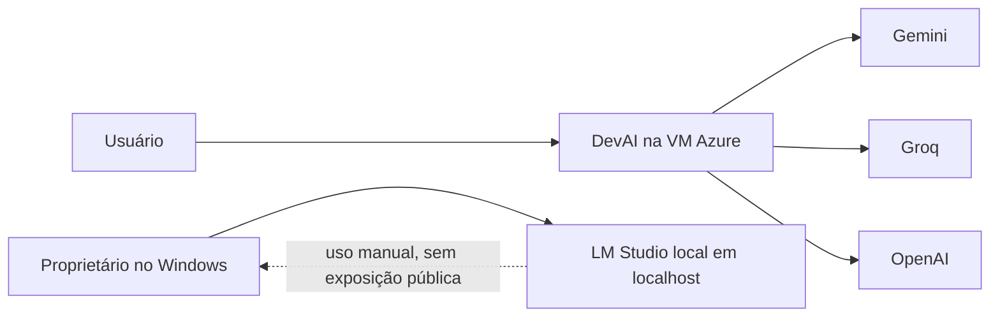

# Operação híbrida segura: VM Azure e modelo local

**Objetivo.** Este guia descreve como manter a IA hospedada na Azure como serviço principal e usar o computador Windows do proprietário somente como alternativa local quando necessário. Ele não ativa nenhuma conexão automaticamente, não muda o comportamento atual da VM e não expõe o modelo local à internet.

> A operação padrão permanece: **Gemini → Groq → OpenAI**, todos executados pela VM. O computador pessoal é uma reserva manual e opcional, não uma dependência para a IA ficar online.

## O que a operação híbrida resolve

| Situação | Comportamento recomendado | O que não fazer |
| --- | --- | --- |
| As APIs da VM funcionam normalmente | Usar a cadeia de provedores já configurada na VM. | Não ligar o computador pessoal sem necessidade. |
| O proprietário quer trabalhar localmente com arquivos ou código privado | Abrir o LM Studio no próprio computador e processar o material localmente. | Não enviar credenciais, documentos sensíveis ou chaves ao chat público. |
| Os provedores remotos falham por algumas horas | Usar o modelo local manualmente; depois levar para a VM somente o resultado que puder ser compartilhado. | Criar redirecionamento de porta do roteador para a API local. |
| Futuramente for desejado um fallback automático | Conectar VM e computador em uma rede privada, com autenticação e regra de acesso mínima; fazer isso apenas após revisão e confirmação do proprietário. | Colocar `http://IP_DO_PC:1234` no código público ou em variáveis expostas ao cliente. |

O LM Studio permite servir modelos por API local a partir da aba **Developer** e também disponibiliza compatibilidade com APIs REST, OpenAI e Anthropic. Por padrão, o servidor pode ser iniciado em `localhost`; essa é a modalidade preferida nesta fase.[1] O serviço local também não exige autenticação por padrão, por isso uma API visível na rede ou na internet sem token não é aceitável.[2] [3]

## Arquitetura recomendada nesta fase

Nesta arquitetura, a VM não precisa conhecer o endereço do computador. O proprietário abre o LM Studio no Windows, inicia um modelo quando precisar e usa a interface local para tarefas de desenvolvimento, rascunhos, revisão ou análise que não devam depender de APIs externas. A IA hospedada continua disponível para os clientes mesmo quando o computador está desligado.

## Procedimento manual seguro no Windows

Primeiro, instale e atualize o LM Studio somente a partir do site oficial. Na aba **Developer**, carregue um modelo compatível com a memória da GPU e use **Start server** ou o comando `lms server start`. A documentação informa que a API local padrão usa `http://localhost:1234`.[1] [3]

Antes de usar, mantenha a opção de servir em rede desativada. O endereço deve ficar como `localhost`, nunca como um endereço público. Se for habilitada autenticação, crie um token exclusivamente para esse servidor e armazene-o apenas no gerenciador de segredos que vier a ser definido; o token não deve ser inserido em mensagens, arquivos `.env` versionados, capturas de tela ou código do frontend. O LM Studio suporta tokens de API e exige o envio deles em cada solicitação após a ativação.[2]

Quando a tarefa terminar, desligue o servidor do LM Studio. Se o computador estiver desligado ou o modelo não estiver carregado, isso não prejudica o funcionamento da IA hospedada: a VM continua usando os provedores remotos configurados.

## Fallback privado futuro — somente após confirmação

Caso o proprietário queira que a VM possa chamar o modelo do Windows automaticamente, a solução aceitável é uma rede privada autenticada entre os dois dispositivos. Uma alternativa é uma rede privada baseada em identidade, como o Tailscale, que oferece controle de acesso para dispositivos conectados.[4] Isso ainda exige configuração consciente dos dois lados e não deve ser iniciado por link público, túnel temporário ou encaminhamento de portas.

| Controle obrigatório | Regra de implementação |
| --- | --- |
| Conectividade | VM e Windows devem estar na mesma rede privada; nenhuma porta deve ser aberta no roteador. |
| Exposição do servidor | Permitir escuta somente na interface privada necessária, nunca na internet pública. |
| Autenticação | Habilitar token no LM Studio e guardar o token apenas como segredo do servidor da VM. |
| Autorização | Permitir apenas o endereço privado da VM; não conceder acesso a toda a rede. |
| Limites | Definir timeout curto, tamanho máximo de pedido, limite de concorrência e fallback imediato aos provedores atuais. |
| Dados | Não encaminhar automaticamente senhas, tokens, chaves, CPF, documentos ou anexos sensíveis. |
| Operação | Ter interruptor de desligamento e registrar apenas erros técnicos sem gravar prompts sensíveis. |

> Não implemente fallback automático enquanto o computador do proprietário não estiver acessível por uma rede privada confiável e ele não autorizar explicitamente a integração. O endereço e o token são segredos operacionais, não informações para a interface do cliente.

## Limites práticos

O computador informado pelo proprietário tem uma RX 7600 com 8 GB de VRAM e 16 GB de RAM. Ele é apropriado para experimentação local com modelos quantizados e tarefas de texto, mas a velocidade, o tamanho de contexto e a qualidade dependem do modelo escolhido, da quantização, dos drivers e do restante de memória disponível. Ele não substitui a redundância remota da VM nem deve receber promessas de desempenho constante.

O primeiro teste, quando o proprietário quiser fazer, deve ser local e simples: abrir o modelo, enviar uma pergunta curta pelo LM Studio e confirmar que o servidor responde em `localhost`. A integração com a VM só deve ser planejada depois disso, com revisão específica de rede e segredos.

## Checklist antes de qualquer integração automática

1. O proprietário confirmou que quer o fallback automático, e não apenas uso manual?
2. O LM Studio está atualizado e respondendo localmente com um modelo carregado?
3. A rede privada entre Windows e VM está criada, com acesso limitado à VM?
4. A autenticação por token está habilitada no servidor local?
5. O token foi cadastrado como segredo do servidor, sem aparecer no código ou no navegador?
6. Existem timeout, interrupção manual e retorno seguro aos provedores remotos?
7. O teste usará uma pergunta sem dados pessoais, credenciais ou arquivos de cliente?

Se qualquer resposta for negativa, mantenha o modo manual. Ele já entrega uma alternativa útil sem aumentar a superfície de ataque da aplicação.

## Referências

[1] [LM Studio — Local LLM API Server](https://lmstudio.ai/docs/developer/core/server)  
[2] [LM Studio — Authentication](https://lmstudio.ai/docs/developer/core/authentication)  
[3] [LM Studio — REST API Quickstart](https://lmstudio.ai/docs/developer/rest/quickstart)  
[4] [Tailscale — Documentation](https://tailscale.com/docs)
